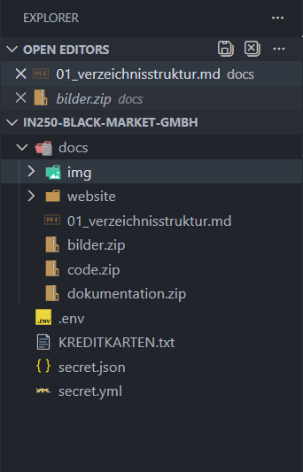

# IN250 – Black Market GmbH

Kurze Beschreibung des Repositories und der Aufgaben aus dem Praxisauftrag.

## Dokumentation
- [Verzeichnisstruktur](docs/01_verzeichnisstruktur.md)

## Tasks
- [x] Repository geforkt und lokal geklont
- [x] Dozent als Collaborator hinzugefügt
- [x] docs-Struktur erstellt und Inhalte verschoben
- [ ] .gitignore und Secrets bereinigen
- [ ] GitHub Actions Automatisierung (stale)
- [ ] Branch-Strategie + Schutzregeln + Tag v1.0
- [ ] Merge-Konflikt erstellen und lösen
- [ ] GitHub Pages aktivieren
- [ ] Abschluss: Security Policy, Dependabot, PR/Issue im Original-Repo

## Quellen

- HFTM IN250 Praxisauftrag v1.0 (PDF: in250-praxisauftrag-v1.0.pdf), Zugriff: 22.02.2026  
  Verwendet für: Aufgabe 3–5 (Vorgaben/Anforderungen)

- Git Cheat Sheet (PDF: git-cheat-sheet-education.pdf), Zugriff: 22.02.2026  
  Verwendet für: Aufgabe 3–4 (Git-Befehle wie clone/status/log/branch/add/commit/push, Remotes)

- Markdown Guide – Cheat Sheet, Zugriff: 22.02.2026, https://www.markdownguide.org/cheat-sheet/  
  Verwendet für: Aufgabe 5 (Markdown-Syntax: Bild, Links, Checkboxen)

- Conventional Commits v1.0.0 (DE), Zugriff: 22.02.2026, https://www.conventionalcommits.org/de/v1.0.0/  
  Verwendet für: Aufgabe 4–5 (Commit-/Titel-Format)

- ChatGPT (Konversationshilfe), Zugriff: 22.02.2026  
  Verwendet für: Aufgabe 3–5 (Schrittfolge, Hinweise, Fehlerbehebung)